# CHCNAV ROS2-Humble Driver

This driver (the `chcnav` package) is used to connect CHCNAV CGI series GNSS/INS integrated navigation devices. It reads mixed-protocol data (CHCNAV CGI custom binary protocol + NMEA protocol) output by the device via **Serial / TCP / UDP / CAN / File**, performs classification, validation, and parsing, and publishes it as ROS2 topics; it also supports forwarding differential data via NTRIP to assist RTK fixing when the device lacks a network connection.

| Version | Description | Author | Date |
| ------ | ------------------------------------------------------ | ------ | ---------- |
| V0.4   | Initial version                                        | Qirong Wu | 2023-04-10 |
| V0.4.1 | Updated UDP documentation                              | Qirong Wu | 2023-04-18 |
| V0.4.2 | Updated environment setup documentation                | Xiaoyong Zhang | 2023-08-16 |
| V1.0.0 | ROS2 usage documentation                               | Xiaoyong Zhang | 2023-10-09 |
| V1.0.3 | Supported humble version and arm architecture          | Yanqi Cheng | 2025-12-05 |
| V1.0.4 | Fixed demo 6 CORS login issue                          | Yanxiang Wang | 2026-05-12 |
| V1.0.5 | README refactored, renamed devimu acceleration variable | Yanxiang Wang | 2026-07-06 |
| V1.0.6 | Supported TCP Server mode, demo_6 supports sending differential data via TCP | Yanxiang Wang | 2026-07-30 |

---

## Table of Contents

- [1. Quick Start](#1-quick-start)
- [2. Topic Description](#2-topic-description)
- [3. Device Configuration](#3-device-configuration)
- [4. Running Examples (demo)](#4-running-examples-demo)
- [5. Coordinate Systems and Angle Conventions](#5-coordinate-systems-and-angle-conventions)
- [6. Timestamp Explanation](#6-timestamp-explanation)
- [7. Common Troubleshooting](#7-common-troubleshooting)
- [Appendix](#appendix)

---

## 1. Quick Start

### 1.1 Prerequisites

- ROS2 Humble installed (Ubuntu 22.04; `ros-humble-desktop` is recommended; `ros-base` lacks some dependencies and requires manual installation). For environment setup, see [Appendix A](#appendix-a-ros2-humble-environment-setup).
- The device has enabled protocol output according to [3. Device Configuration](#3-device-configuration) (Recommended: `HCINSPVATZCB`, `GPCHC`, `GPGGA`).

### 1.2 Build

```shell
# Extract the source code package
tar -zxvf ./humble-chcnav-cgi_ros2pkg_v1.0.5.tar.gz
# Enter the workspace root directory
cd humble-chcnav-cgi_ros2pkg_v1.0.5
# Confirm the src directory exists, containing chcnav and msg_interfaces packages
ls ./src
# Build (both msg_interfaces and chcnav packages must be built successfully)
colcon build
# Source the runtime environment
source ./install/setup.bash
```

### 1.3 Serial Permissions (Only required for Serial mode)

Add the current user to the `dialout` group (one-time configuration, permanent effect, requires re-login):

```shell
sudo usermod -aG dialout $USER
```

Or grant temporary permission: `sudo chmod 777 /dev/ttyUSB0`

### 1.4 Run

```shell
# Taking the serial demo as an example, both xml and py launch formats are supported
ros2 launch ./src/chcnav/launch/demo_1.xml
```

### 1.5 Verification

```shell
ros2 topic list
# You should be able to see:
#   /chcnav/nmea_sentence
#   /chcnav/hc_sentence
#   /chcnav/devpvt
#   /chcnav/devimu

ros2 topic echo /chcnav/devpvt     # Continuous output indicates the link is normal
```

If there is no output, refer to [7. Common Troubleshooting](#7-common-troubleshooting) for troubleshooting steps.

---

## 2. Topic Description

The driver identifies any supported protocol from the input data stream and publishes it to the corresponding topic (except for the CAN mode, see the declaration in [4.1](#41-demo_0-can)):

| Topic | Protocol / Source | Message Type | Checksum / Notes |
| --- | --- | --- | --- |
| `/chcnav/nmea_sentence` | NMEA (Starts with `$`, ends with `*XOR`, e.g., GPGGA / GPCHC / GPRMC) | `msg_interfaces/msg/String` | **Passed** XOR checksum |
| `/chcnav/hc_sentence` | CHCNAV CGI custom protocol (header format, e.g., HCINSPVATZCB, HCRAWIMUB) | `msg_interfaces/msg/HcSentence` | **No** CRC32 checksum (raw binary passthrough) |
| `/chcnav/devpvt` | HCINSPVATZCB (GNSS/INS data) | `msg_interfaces/msg/Hcinspvatzcb` | **Passed** CRC32 checksum |
| `/chcnav/devimu` | HCRAWIMUIB (Raw IMU) | `msg_interfaces/msg/Hcrawimub` | **Passed** CRC32 checksum |
| `/fix` | Converted from `devpvt` | `sensor_msgs/msg/NavSatFix` | **Published only when demo_9 is running** |
| `/imu` | Converted from `devpvt` | `sensor_msgs/msg/Imu` | **Published only when demo_9 is running** |

Notes:

- Multiple parsing nodes (multi-channel serial/TCP) can run simultaneously and publish data to the same topic, distinguishing sources via `header.frame_id` (i.e., node `name`).
- By default, `ros2 topic echo` truncates strings exceeding 128 characters and arrays exceeding 16 elements (displaying `...` at the end), which is a display behavior; the data itself is complete. Add the `--full-length` (or `-f`) parameter to view the full text.
- Custom message topics (the 4 under `/chcnav/`) require `source install/setup.bash` before they can be subscribed to; `/fix` and `/imu` are standard ROS messages and can be subscribed to without sourcing.

The field descriptions and output examples for each topic are as follows. For full field definitions, see the `msg_interfaces` package (the homonymous files under `chcnav/msg/` are for field comment references).

### 2.1 nmea_sentence

NMEA sentence string. The content includes the trailing checksum but excludes `\r\n`.

```
std_msgs/Header header
string sentence    # NMEA sentence, including checksum, excluding \r\n
```

Output example (`ros2 topic echo -f /chcnav/nmea_sentence`):

```yaml
header:
  stamp:
    sec: 1783334916
    nanosec: 104955128
  frame_id: rs232
sentence: $GPCHC,2426,125334.00,178.41,0.84,-0.01,0.01,-0.02,0.02,0.0011,-0.0027,0.9990,31.15959807,121.17847900,49.70,-0.003,0.007,-0.034,0.008,28,36,61,0,0102*4B
```

### 2.2 hc_sentence

Raw binary string of the CHCNAV CGI custom protocol (displayed in decimal when echoed).

```
std_msgs/Header header
int16  msg_id      # Protocol id
int8[] data        # Protocol raw binary string
```

Output example (`ros2 topic echo -f /chcnav/hc_sentence`, `data` is long, truncated here for display):

```yaml
header:
  stamp:
    sec: 1783334744
    nanosec: 105300582
  frame_id: rs232
msg_id: 4609
data:
- -86
- -52
- 72
- 67
- 14
- 1
- 1
- 18
- 122
- 9
- 16
- -46
- ...
```

### 2.3 devpvt（Hcinspvatzcb）

GNSS/INS PVT results. Key fields:

- Time: `week` (GPS week), `second` (Seconds into GPS week)
- Position: `latitude`/`longitude` (deg), `altitude` (m), `position_stdev[3]`
- Attitude: `roll`/`pitch`/`yaw` (deg) and `euler_stdev[3]`, `heading` (deg), `heading2` (deg), angle conventions see [5. Coordinate Systems and Angle Conventions](#5-coordinate-systems-and-angle-conventions)
- Velocity: `speed` (Ground speed), `enu_velocity` (East-North-Up, m/s) and `enu_velocity_stdev[3]`, `vehicle_linear_velocity` (Vehicle frame)
- IMU: `vehicle_angular_velocity` (Vehicle frame angular velocity), `vehicle_linear_acceleration` (Vehicle frame linear acceleration), `vehicle_linear_acceleration_without_g` (Vehicle frame acceleration, no gravity), `raw_angular_velocity` (Raw angular velocity, Vehicle frame), `raw_acceleration` (Raw acceleration, Vehicle frame, includes gravity)
- Status: `stat[0]` INS status (0 Init / 1 GNSS / 2 GNSS+INS / 3 Pure INS); `stat[1]` GNSS status (0 Invalid / 1 Single point / 2 Pseudorange diff / 3 Dead reckoning / 4 RTK Fix / 5 RTK Float / 6~9 Non-oriented variants)
- Quality: `age` (Differential age s), `ns`/`ns2` (Main/Secondary antenna satellite count), `leaps` (Leap seconds), `hdop`/`pdop`/`vdop`/`tdop`/`gdop` (Dilution of precision)
- Lever arm and installation angles: `ins2gnss_vector`, `ins2body_angle` (Z-X-Y rotation sequence), `gnss2body_vector`, `gnss2body_angle_z`
- Others: `warning` (Warning flags), `sensor_used` (Sensor usage flags)

Output example (`ros2 topic echo /chcnav/devpvt`):

```yaml
header:
  stamp:
    sec: 1783334320
    nanosec: 0
  frame_id: rs232
week: 2426
second: 124738.0
latitude: 31.1596001694612
longitude: 121.17847684603186
altitude: 49.7773551940918
position_stdev:
- 2.221238851547241
- 2.0861754417419434
- 2.3879024982452393
undulation: 10.531000137329102
roll: -0.09104868024587631
pitch: 0.8102092742919922
yaw: -8.303703308105469
euler_stdev:
- 10.0
- 10.0
- 2241.758056640625
speed: 0.0026421924121677876
heading: 0.0
heading2: 8.303703308105469
enu_velocity:
  x: 0.0007986590499058366
  y: -0.0025185956619679928
  z: 0.00819416344165802
enu_velocity_stdev:
- 0.014211289584636688
- 0.015717001631855965
- 0.016012882813811302
vehicle_angular_velocity:
  x: 0.0
  y: 0.0
  z: 0.0
vehicle_linear_velocity:
  x: 0.0012667716946452856
  y: -0.0023472311440855265
  z: 0.008186043240129948
vehicle_linear_acceleration:
  x: 0.0024589765816926956
  y: -0.0032717182766646147
  z: 0.9993849992752075
vehicle_linear_acceleration_without_g:
  x: 0.0
  y: 0.0
  z: 0.0
raw_angular_velocity:
  x: 0.027499999850988388
  y: -0.03500000014901161
  z: 0.012500000186264515
raw_acceleration:
  x: 0.0016309887869283557
  y: -0.002568807452917099
  z: 1.0028542280197144
stat:
- 1
- 6
age: 0.0
ns: 38
ns2: 38
leaps: 18
hdop: 0.6048346161842346
pdop: 1.1465815305709839
vdop: 0.9740760922431946
tdop: 1.3441734313964844
gdop: 1.7667629718780518
ins2gnss_vector:
  x: -0.43537795543670654
  y: 1.4467837810516357
  z: 1.0168766975402832
ins2body_angle:
  x: -0.9567292928695679
  y: 0.0
  z: 0.15156368911266327
gnss2body_vector:
  x: 0.5
  y: -0.8999999761581421
  z: -1.25
gnss2body_angle_z: -1.1350784301757812
warning: 258
sensor_used: 1
receiver:
- 0
- 0
- 0
- 0
- 0
- 0
- 0
- 0
- 0
- 0
- 0
- 0
- 0
- 0
- 0
- 0
```

### 2.4 devimu（Hcrawimub）

Raw IMU data (derived from the HCRAWIMUIB protocol): `angular_velocity` (deg/s), `linear_acceleration`, `temp` (℃), `err_status`, `yaw` (Z-axis gyro integrated heading, -180~180, scale factor 0.01).

Output example (`ros2 topic echo /chcnav/devimu`):

```yaml
header:
  stamp:
    sec: 1735870604
    nanosec: 440000057
  frame_id: rs232
week: 2347
second: 440222.44
angular_velocity:
  x: 0.399196624756
  y: 0.00500373821706
  z: 0.11791343987
linear_acceleration:
  x: -0.009342151694
  y: 0.00973399356008
  z: 0.999167382717
temp: 35.4000015259
err_status: 0
yaw: 0
receiver: 0
```

### 2.5 fix (Only demo_9)

ROS standard GNSS positioning message `sensor_msgs/msg/NavSatFix`, published after `devpvt` is converted by the `ChcnavFixDemo` node of [demo_9](#49-demo_9-serial--fiximu-conversion).

- Latitude, longitude, and altitude are taken from `devpvt`;
- `status.status`: 0 when RTK is fixed, otherwise -1;
- `status.service` is fixed to 4.

Output example (`ros2 topic echo /fix`):

```yaml
header:
  stamp:
    sec: 1783336138
    nanosec: 0
  frame_id: rs232
status:
  status: -1
  service: 4
latitude: 31.159594823977727
longitude: 121.17847641933443
altitude: 49.76423263549805
position_covariance:
- 0.0
- 0.0
- 0.0
- 0.0
- 0.0
- 0.0
- 0.0
- 0.0
- 0.0
position_covariance_type: 0
```

### 2.6 imu (Only demo_9)

ROS standard IMU message `sensor_msgs/msg/Imu`, published after `devpvt` is converted by the `ChcnavFixDemo` node of [demo_9](#49-demo_9-serial--fiximu-conversion).

- The data is in the **vehicle coordinate system**, and the acceleration is not gravity-compensated;
- Angular velocity has been converted from deg/s to **rad/s**;
- `orientation` quaternion is generated from the heading converted from `roll`/`pitch` and `heading2`;
- `header.stamp` is the **system time** (different from the GPS time of `devpvt`).

Output example (`ros2 topic echo /imu`):

```yaml
header:
  stamp:
    sec: 1783336388
    nanosec: 78776621
  frame_id: rs232
orientation:
  x: -0.006603982194663941
  y: -0.0019480930638164154
  z: -0.9355052313872833
  w: 0.35324574222432303
orientation_covariance:
- 0.0
- 0.0
- 0.0
- 0.0
- 0.0
- 0.0
- 0.0
- 0.0
- 0.0
angular_velocity:
  x: 0.0
  y: 0.0
  z: 0.0
angular_velocity_covariance:
- 0.0
- 0.0
- 0.0
- 0.0
- 0.0
- 0.0
- 0.0
- 0.0
- 0.0
linear_acceleration:
  x: 0.0018881304422393441
  y: -0.003679465502500534
  z: 0.9994257688522339
linear_acceleration_covariance:
- 0.0
- 0.0
- 0.0
- 0.0
- 0.0
- 0.0
- 0.0
- 0.0
- 0.0
```

---

## 3. Device Configuration

Taking the CGI-430 as an example, configurations are completed by entering the device's web page after connecting to the CGI device's hotspot. If it is a CGI-230, the output is configured by sending commands, such as `log com1 gpchc ontime 0.1`.

### 3.1 Serial

1. Go to `IMU -> Output Configuration`, and enable the required protocols in **Serial C Settings**.
2. Recommended configuration: enable `HCINSPVATZCB`, `GPCHC`, `GPGGA`, and turn off the rest.
3. The serial baud rate is modified in the `I/O Settings` page.

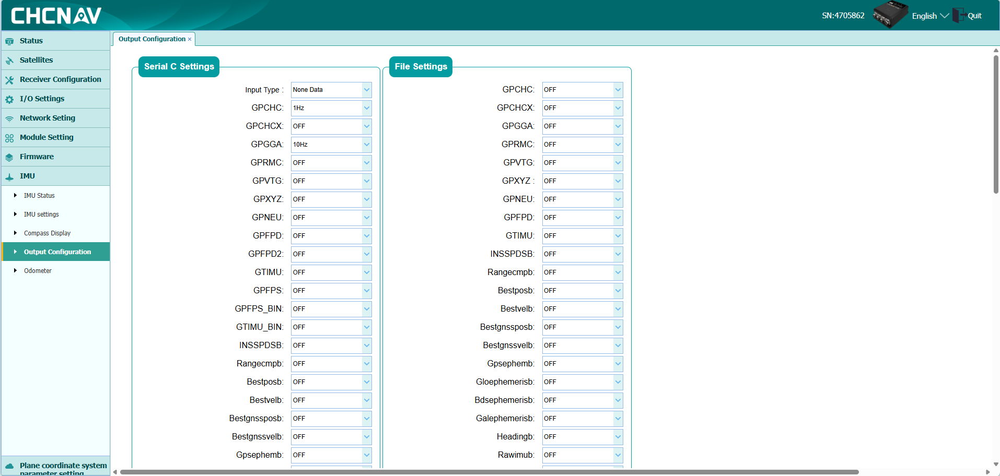
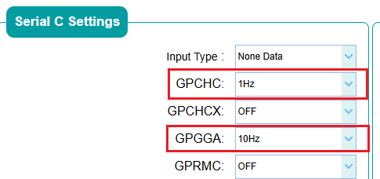


> **Bandwidth Note**: Serial port bandwidth ≈ Baud rate / 10 bytes per second (460800 baud rate is approximately 46080 B/s). If the total output bandwidth of the enabled protocols exceeds the serial port bandwidth, data backlog delays will occur (receiving data from several seconds ago). Please estimate the bandwidth before increasing the protocol frequency.

### 3.2 TCP

Go to `I/O Settings -> I/O Settings`, and enable the required protocols in `TCP Server` or `TCP/UDP_Client`.

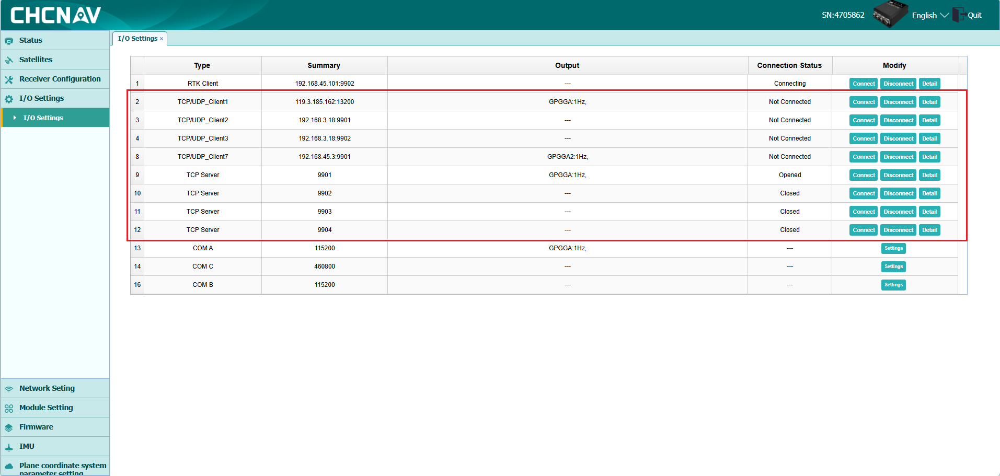
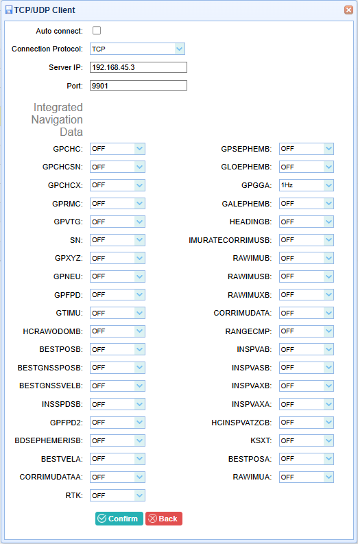

- If the device is a TCP Server, the ROS side needs to use `type = tcp` to connect to the device as a TCP Client, and specify the device address via `host` / `port`.
- If the device is a TCP Client, the ROS side needs to use `type = tcp_server` as a TCP Server to listen to the port. After the device connects, it can send and receive in both directions.
- When GGA and differential data are split into two TCP links, they can be divided using `enable_read` and `enable_write`: one connection with `enable_read=true, enable_write=false` only receives GGA, and the other connection with `enable_read=false, enable_write=true` only sends differential data.

### 3.3 UDP

Go to `I/O Settings -> I/O Settings`, and enable the required protocols in `TCP/UDP_Client`. The port number is custom, **and the IP should be filled with the address of the PC running ROS2**.

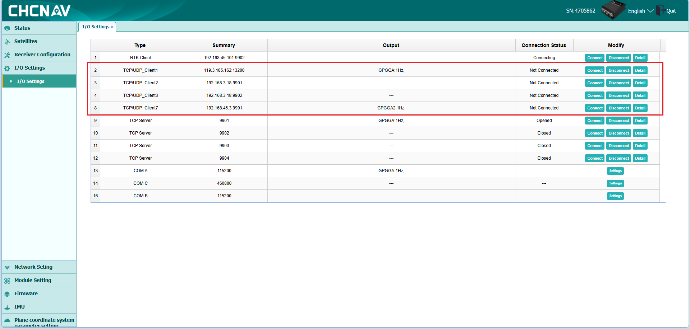
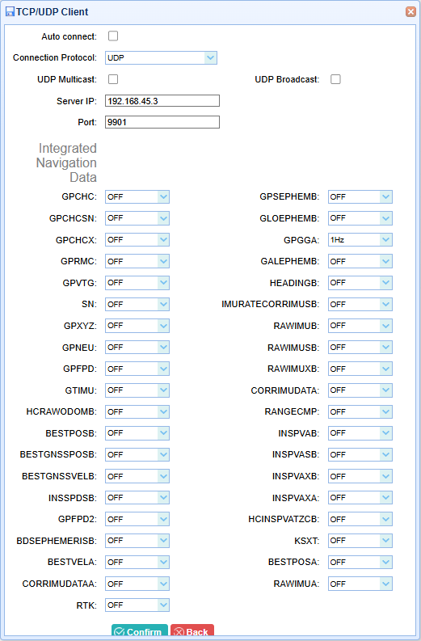
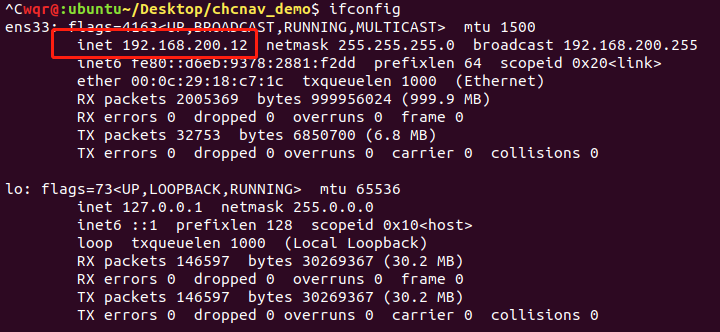

### 3.4 CAN

Go to `IMU -> Output Configuration`, and enable the required protocols in **CAN ID Settings**.

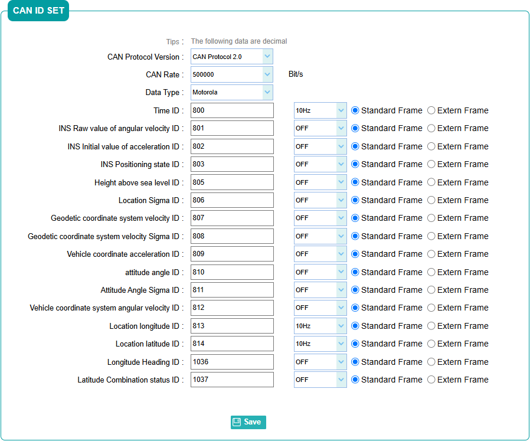

---

## 4. Running Examples (demo)

Each demo under `launch/` provides both `xml` and `py` formats (`demo_0` and `demo_6` are xml only). This section uses xml as an example to explain one by one.

### 4.0 Node Composition

Each demo is composed of the following nodes combined (taking `demo_3` node relationships as an example):

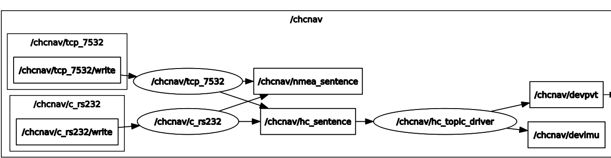

- **HcMsgParserLaunchNode (Data Access / Packet Splitting Node)**: Reads mixed data streams from Serial/TCP/UDP/CAN/File, classifies them according to protocols, and publishes them to `hc_sentence`, `nmea_sentence` (CAN method is an exception, only printed in the terminal, see the declaration in [4.1](#41-demo_0-can)). Select the data source type through the `type` parameter; the required parameters for different data sources are detailed in each demo subsection. It also subscribes to the private topic `write` (`msg_interfaces/msg/Int8Array`): binary data published to this topic will be written back to the device connected via Serial/TCP (NTRIP differential data transmission relies on this topic).
  - `enable_read` / `enable_write` can separately control read/write capabilities, supporting "GGA read link" and "differential write link" separation scenarios.
- **HcCgiProtocolProcessNode (Protocol Parsing Node)**: Subscribes to `hc_sentence`, performs CRC32 validation on binary protocols before parsing, and publishes `devpvt` (HCINSPVATZCB) and `devimu` (HCRAWIMUIB). No parameters, just declare it directly.
- **NtripServerLaunchNode (NTRIP Node)**: Used only in demo_6.

All `HcMsgParserLaunchNode` support several common parameters:

| Parameter Name | Type | Default Value | Description |
| --- | --- | --- | --- |
| `type` | string | None | `serial` / `tcp` / `tcp_server` / `udp` / `can` / `file` |
| `rate` | int | 1000 | Maximum number of protocols parsed per second |
| `enable_read` | bool | true | Whether to read and parse data from the device, when `false` only retains write-back capability |
| `enable_write` | bool | true | Whether to subscribe to the private `write` topic and write the received data back to the device |

> **Node Naming Restrictions**: Do not start `name` with an uppercase letter, and do not include special characters like underscores, otherwise `frame_id` will cause downstream tools like RViz2 to report a `Message Filter dropping message` error.

### 4.1 demo_0 (CAN)

You must configure the device first according to [3.4 CAN](#34-can).

> **Important Declaration**:
>
> 1. **The CAN method currently does not publish ROS topics**. Unlike Serial/TCP/UDP, the decoding results of CAN frames (position, attitude, velocity, etc.) are only printed as logs in the terminal, and topics like `/chcnav/hc_sentence`, `/chcnav/devpvt` **will have no data**. If you need to obtain data via topics, please use the Serial/TCP/UDP access methods.
> 2. The `dev` parameter must be a **SocketCAN network interface name** (i.e., `can0`/`vcan0` visible in `ip link`), and other device nodes are not supported. The USB-CAN adapter must come with its own kernel SocketCAN driver; adapters that only provide user-mode APIs cannot be used directly.

```xml
<launch>
    <!-- hc_cgi_protocol_process_node -->
    <node pkg="chcnav" exec="HcCgiProtocolProcessNode" name="hc_topic_driver" output="screen"/>

    <!-- hc_msg_parser_launch_node  -->
    <node pkg="chcnav" exec="HcMsgParserLaunchNode" name="CAN" output="screen">
        <!-- CAN settings -->
        <param name="type" value="can"/>
        <param name="dev" value="vcan0"/>                           <!-- CAN Device Name -->
        <param name="can_rate" value="500000"/>                     <!-- CAN Rate Bit/s -->
        <param name="data_format" value="motorola"/>                <!-- Data format supports "motorola" or "intel" -->

        <param name="time_id" value="800"/>                         <!-- Time ID  -->
        <param name="angrate_rawIMU_id" value="801"/>               <!-- IMU raw angular velocity ID  -->
        <param name="accel_rawIMU_id" value="802"/>                 <!-- IMU raw acceleration ID  -->
        <param name="sys_status_id" value="803"/>                   <!-- INS positioning status ID  -->
        <param name="altitude_id" value="805"/>                     <!-- Altitude ID  -->
        <param name="pos_sigma_id" value="806"/>                    <!-- Position sigma ID  -->
        <param name="velocity_level_id" value="807"/>               <!-- Geodetic coordinate system velocity ID  -->
        <param name="velocity_level_sigma_id" value="808"/>         <!-- Geodetic coordinate system velocity sigma ID  -->
        <param name="accel_vehicle_id" value="809"/>                <!-- Vehicle coordinate system acceleration ID  -->
        <param name="heading_pitch_roll_id" value="810"/>           <!-- Attitude angle ID  -->
        <param name="heading_pitch_roll_sigma_id" value="811"/>     <!-- Attitude angle sigma ID  -->
        <param name="angrate_vehicle_id" value="812"/>              <!-- Vehicle coordinate system angular velocity ID  -->
        <param name="longitude_id" value="813"/>                    <!-- Positioning longitude ID  -->
        <param name="latitude_id" value="814"/>                     <!-- Positioning latitude ID  -->
        <!-- CAN settings end -->
    </node>

</launch>
```

Parameter description:

| Parameter Name | Type | Default Value | Description |
| --- | --- | --- | --- |
| `dev` | string | None | CAN device name, such as `can0` / `vcan0` |
| `can_rate` | int | None | CAN rate Bit/s, such as 500000 |
| `data_format` | string | None | `motorola` or `intel` |
| `time_id` and other message IDs | int | See xml above | Various CAN message ID mappings, corresponding one-to-one with the CAN ID settings on the device side |

### 4.2 demo_1 (Serial)

The most commonly used introductory example. You must configure the device first according to [3.1 Serial](#31-serial) and complete the [1.3 Serial Permissions](#13-serial-permissions-only-required-for-serial-mode).

```xml
<launch>
    <!-- hc_cgi_protocol_process_node -->
    <node pkg="chcnav" exec="HcCgiProtocolProcessNode" name="hc_topic_driver" output="screen"/>

    <!-- hc_msg_parser_launch_node  -->
    <node pkg="chcnav" exec="HcMsgParserLaunchNode" name="rs232" output="screen">
        <!-- serial settings -->
        <param name="type" value="serial"/>
        <param name="rate" value="1000"/>         <!-- Maximum number of protocols parsed per second by the node -->
        <param name="port" value="/dev/ttyUSB0"/> <!-- Serial port path, modify according to actual situation -->
        <param name="baudrate" value="460800"/>   <!-- Baud rate, modify according to actual situation -->
        <!-- serial settings end -->
    </node>

</launch>
```

Parameter description:

| Parameter Name | Type | Default Value | Description |
| --- | --- | --- | --- |
| `port` | string | None | Serial port path, such as `/dev/ttyUSB0` |
| `baudrate` | int | 115200 | Baud rate, consistent with device serial configuration |
| `databits` | int | 8 | Data bits (generally use the default value) |
| `stopbits` | int | 1 | Stop bits (generally use the default value) |
| `parity` | string | None | Parity bit None/Odd/Even (generally use the default value) |

### 4.3 demo_2 (TCP)

You must configure the device first according to [3.2 TCP](#32-tcp).

- When the device is a TCP Server, the ROS side uses `type = tcp` to connect to the device as a TCP Client;
- When the device is a TCP Client, the ROS side uses `type = tcp_server` to listen for device connections as a TCP Server.

The following example assumes the device is a TCP Server:

```xml
<launch>
    <!-- hc_topic_driver -->
    <node pkg="chcnav" exec="HcCgiProtocolProcessNode" name="hc_topic_driver" output="screen"/>

    <!-- hc_msg_parser_launch_node -->
    <node pkg="chcnav" exec="HcMsgParserLaunchNode" name="tcp_7532" output="screen">
        <!-- tcp settings -->
        <param name="type" value="tcp"/>
        <param name="rate" value="1000"/>           <!-- Maximum number of protocols parsed per second by the node -->
        <param name="host" value="192.168.200.1"/>  <!-- ip address, modify according to actual situation -->
        <param name="port" value="7532"/>           <!-- Port number, modify according to actual situation -->
        <!-- tcp settings end -->
    </node>

</launch>
```

Parameter description:

| Parameter Name | Type | Default Value | Description |
| --- | --- | --- | --- |
| `host` | string | None | Device IP address (fill in the device address when the device is a TCP Server; no need to set when the device is a TCP Client) |
| `port` | int | None | Port number, consistent with device TCP configuration |

### 4.4 demo_3 (UDP)

You must configure the device first according to [3.3 UDP](#33-udp).

```xml
<launch>
    <!-- hc_topic_driver -->
    <node pkg="chcnav" exec="HcCgiProtocolProcessNode" name="hc_topic_driver" output="screen"/>

    <!-- hc_msg_parser_launch_node -->
    <node pkg="chcnav" exec="HcMsgParserLaunchNode" name="udp_7531" output="screen">
        <!-- udp settings -->
        <param name="type" value="udp"/>
        <param name="rate" value="1000"/>           <!-- Maximum number of protocols parsed per second by the node -->
        <param name="port" value="7531"/>           <!-- Port number, modify according to actual situation -->
        <!-- udp settings end -->
    </node>

</launch>
```

Parameter description:

| Parameter Name | Type | Default Value | Description |
| --- | --- | --- | --- |
| `port` | int | None | Listening port number, consistent with the port filled in the device UDP configuration (no need for `host` parameter) |

### 4.5 demo_4 (TCP + Serial Mixed)

Multi-data source parallel access: You must complete the TCP and Serial configurations of the devices simultaneously. The data from different parsing nodes is published to the same topic, and sources are distinguished by node `name` (i.e., message `frame_id`). In addition to the TCP + Serial in this example, more nodes can be added in the same way.

```xml
<launch>
    <!-- hc_topic_driver -->
    <node pkg="chcnav" exec="HcCgiProtocolProcessNode" name="hc_topic_driver" output="screen"/>

    <!-- tcp -->
    <node pkg="chcnav" exec="HcMsgParserLaunchNode" name="tcp_7532" output="screen">
        <param name="type" value="tcp"/>
        <param name="rate" value="1000"/>
        <param name="host" value="192.168.200.1"/>
        <param name="port" value="7532"/>
    </node>

    <!-- rs232 -->
    <node pkg="chcnav" exec="HcMsgParserLaunchNode" name="rs232" output="screen">
        <param name="type" value="serial"/>
        <param name="rate" value="1000"/>
        <param name="port" value="/dev/ttyUSB0"/>
        <param name="baudrate" value="460800"/>
    </node>

</launch>
```

### 4.6 demo_5 (Offline File Parsing)

Parses a pre-recorded protocol raw data file and logs the parsing results to the `install/chcnav/lib/chcnav/xxx_sentence_record` file.

```xml
<launch>
    <node pkg="chcnav" exec="RecordMsgToFile" name="record_msg_to_file" output="screen"/>

    <!-- hc_topic_driver -->
    <node pkg="chcnav" exec="HcCgiProtocolProcessNode" name="hc_topic_driver" output="screen"/>

    <!-- hc_msg_parser_launch_node -->
    <node pkg="chcnav" exec="HcMsgParserLaunchNode" name="file" output="screen">
        <!-- file settings -->
        <param name="type" value="file"/>
        <param name="rate" value="1000"/>                 <!-- Maximum number of protocols parsed per second by the node -->
        <param name="path" value="/path/to/record.txt"/>  <!-- Protocol file absolute path, modify according to actual situation -->
        <!-- file settings end -->
    </node>

</launch>
```

Parameter description:

| Parameter Name | Type | Default Value | Description |
| --- | --- | --- | --- |
| `path` | string | None | The absolute path of the protocol raw data file |

> Note: You need to press `Ctrl+C` in the terminal to close the process before you can get the complete record file.

### 4.7 demo_6 (NTRIP Differential Assistant Fixing)

When the device itself cannot directly access the Internet, differential data can be proxied by the PC end: the driver receives the GGA output by the device, uploads it to the NTRIP server, and sends the differential data returned by the server to the device via serial port to complete RTK fixing.

This scheme applies to the following scenarios:

- The device only has serial or TCP communication capabilities, and there is no direct networking condition;
- The device can output GGA data and can receive differential data;
- In the absence of an external network, it is necessary to complete differential assisted positioning through PC forwarding.

If the device communicates via serial port, you can directly use the `demo_6.xml` example:

```xml
<launch>
    <!-- hc_msg_parser_launch_node  -->
    <node pkg="chcnav" exec="HcMsgParserLaunchNode" name="c_rs232" output="screen">
        <!-- serial settings -->
        <param name="type" value="serial"/>
        <param name="rate" value="1000"/>
        <param name="port" value="/dev/ttyUSB0"/>
        <param name="baudrate" value="115200"/>
        <!-- serial settings end -->
    </node>

    <!-- hc_cgi_protocol_process_node -->
    <node pkg="chcnav" exec="HcCgiProtocolProcessNode" name="hc_topic_driver" output="screen"/>

    <!-- ntrip_server -->
    <node pkg="chcnav" exec="NtripServerLaunchNode" name="ntrip_server" output="screen">
        <param name="frame_id" value="c_rs232"/>

        <param name="login_type" value="third_cors"/>

        <param name="host" value="119.3.136.126"/>
        <param name="port" value="8002" type="str"/>
        <param name="mountpoint" value="RTCM33"/>
        <param name="username" value=""/>
        <param name="password" value="" type="str"/>

        <remap from="/differential_data" to="/write"/>
        <remap from="/ntrip_source" to="/chcnav/nmea_sentence"/>
    </node>

</launch>
```

If the device uses a single TCP bidirectional connection, you can directly use `type="tcp"` or `type="tcp_server"`;
If the device splits the GGA and differential streams into two independent connections, you can use the dual-node configuration of "GGA read-only / differential write-only" (`demo_6_tcp.xml`). Here is a typical example:

```xml
<launch>
    <!-- GGA receiving node: device as TCP Server, ROS as TCP Client -->
    <node pkg="chcnav" exec="HcMsgParserLaunchNode" name="tcp_gga" output="screen">
        <param name="type" value="tcp"/>
        <param name="rate" value="1000"/>
        <param name="host" value="192.168.45.100"/>
        <param name="port" value="9901"/>
        <param name="enable_read" value="true"/>
        <param name="enable_write" value="false"/>
    </node>

    <!-- Differential sending node: device as TCP Client, ROS as TCP Server -->
    <node pkg="chcnav" exec="HcMsgParserLaunchNode" name="tcp_diff" output="screen">
        <param name="type" value="tcp_server"/>
        <param name="rate" value="1000"/>
        <param name="port" value="9902"/>
        <param name="host" value="0.0.0.0"/>
        <param name="enable_read" value="false"/>
        <param name="enable_write" value="true"/>
    </node>

    <!-- hc_cgi_protocol_process_node -->
    <node pkg="chcnav" exec="HcCgiProtocolProcessNode" name="hc_topic_driver" output="screen"/>

    <!-- ntrip_server -->
    <node pkg="chcnav" exec="NtripServerLaunchNode" name="ntrip_server" output="screen">
        <param name="frame_id" value="tcp_gga"/>          <!-- Must be consistent with the name of the parsing node receiving GGA -->

        <param name="login_type" value="third_cors"/>

        <param name="host" value="119.3.136.126"/>
        <param name="port" value="8002" type="str"/>
        <param name="mountpoint" value="RTCM33"/>
        <param name="username" value=""/>
        <param name="password" value="" type="str"/>

        <remap from="/differential_data" to="/write"/>
        <remap from="/ntrip_source" to="/chcnav/nmea_sentence"/>
    </node>
</launch>
```

**Topics**:

- Subscribes to `ntrip_source` (`msg_interfaces/msg/String`): GGA data source, usually remapped from `/chcnav/nmea_sentence`
- Publishes `differential_data` (`msg_interfaces/msg/Int8Array`): Differential data, needs to be remapped to the parsing node's `write` topic to write back to the device

The `ntrip_server` node must configure the `frame_id` parameter (specifying the `frame_id` of the GGA message source, which needs to be consistent with the parsing node `name`), use a third-party CORS for the login method (`login_type = third_cors`), and the required parameters are shown in the launch example above.

### 4.8 demo_7 / demo_8 (Time Uniformity Test)

Performs a publication interval stability test on TCP (demo_7) and Serial (demo_8) data respectively, used to detect packet loss, checksum failures, and transmission delays. The launch structure is the same as demo_2 / demo_1, with just an extra recording node added:

```xml
<node pkg="chcnav" exec="TimeUniformityNode" name="time_uniformity_node" output="screen"/>
```

For test steps and result analysis, see [Appendix B](#appendix-b-time-uniformity-test).

### 4.9 demo_9 (Serial + fix/imu Conversion)

`demo_9` converts `devpvt` into standard `sensor_msgs/msg/Imu` and `sensor_msgs/msg/NavSatFix`, source code can be found in `src/demo/ChcnavFixDemo.cpp`. For the field descriptions and output examples of the published `/fix`, `/imu` topics, see [2.5](#25-fix-only-demo_9), [2.6](#26-imu-only-demo_9).

```xml
<launch>
    <!-- hc_cgi_protocol_process_node -->
    <node pkg="chcnav" exec="HcCgiProtocolProcessNode" name="hc_topic_driver" output="screen"/>

    <!-- hc_msg_parser_launch_node  -->
    <node pkg="chcnav" exec="HcMsgParserLaunchNode" name="rs232" output="screen">   <!-- Do not start name with an uppercase letter, do not include special characters like "_" -->
        <param name="type" value="serial"/>
        <param name="rate" value="1000"/>
        <param name="port" value="/dev/ttyUSB0"/>
        <param name="baudrate" value="460800"/>
    </node>

    <node pkg="chcnav" exec="ChcnavFixDemo" name="chcnav_fix_demo" output="screen"/>
</launch>
```

It also publishes a static TF: `map -> chcnav -> rs232` (used for RViz2 display).

**RViz2 Visualization**:

```shell
sudo apt install ros-humble-imu-tools   # This plugin is needed for RViz2 to display Imu messages
ros2 run rviz2 rviz2                    # Add -> Imu, Topic select /imu
```

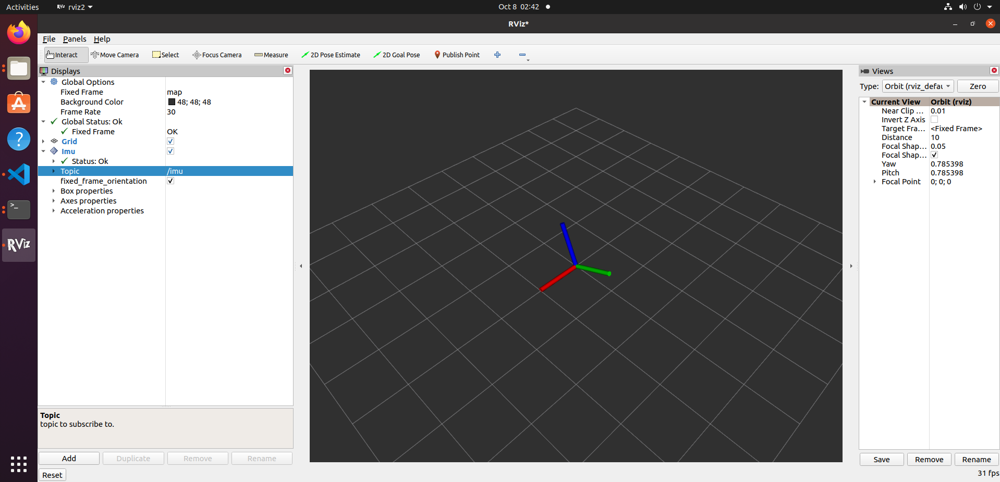

---

## 5. Coordinate Systems and Angle Conventions

There are three easily confusing heading angles in `devpvt`, with different conventions:

| Field | Meaning | Range | Direction Convention |
| --- | --- | --- | --- |
| `yaw` | INS Heading (Default Vehicle Frame) | (-180, +180] | Right-hand rule, counter-clockwise is positive |
| `heading` | Velocity Heading (Track Angle) | [0, 360) | Clockwise is positive |
| `heading2` | INS Heading (Vehicle frame, outputs dual-antenna heading in GNSS mode, outputs INS heading in integrated mode) | [0, 360) | Clockwise is positive |

> Note: The angle unit of custom messages published by the driver is **deg**, which is inconsistent with REP-103 (rad, ENU); for how to convert to standard `sensor_msgs/Imu`, `sensor_msgs/NavSatFix`, see [4.9 demo_9](#49-demo_9-serial--fiximu-conversion).

---

## 6. Timestamp Explanation

- `nmea_sentence`, `hc_sentence`: `header.stamp` is the **system receiving time**.
- `devpvt`, `devimu`: `header.stamp` is the **GPS time** (not system time) from within the protocol, conversion formula:

```
ros_time = gps_week * 7 * 24 * 3600 + gps_seconds + 315964800 - leaps
```

Where `315964800` is the second difference between the GPS time origin (1980-01-06) and the Unix time origin (1970-01-01), and `leaps` is the number of leap seconds (dynamically read from the HCINSPVATZCB protocol, not hard-coded). For implementation, see `src/hc_cgi_protocol_process_node/HcCgiProtocolProcessNode.cpp`.

---

## 7. Common Troubleshooting

**Cannot see /chcnav topics in `ros2 topic list`** → The launch failed to start, check if the build was successful, and whether the current terminal has executed `source install/setup.bash` (every newly opened terminal needs to source; standard message topics like `/fix`, `/imu` are not affected, but custom message topics under `/chcnav` must be sourced before they can be subscribed).

**`nmea_sentence` / `hc_sentence` contents are incomplete (ending in `...`)** → `ros2 topic echo` defaults to truncating strings exceeding 128 characters and arrays exceeding 16 elements, which is a display behavior; the data itself is complete. Add `--full-length` (or `-f` for short) to view the full text.

**No data on topics** → The driver is not receiving data from the device:

1. Check the device-side protocol output configuration (Recommended configurations in [3. Device Configuration](#3-device-configuration));
2. Use third-party tools (like `cutecom`, `nc`) to confirm whether the serial/TCP link itself has data;
3. For serial mode, confirm the device path and access permissions, and confirm the serial port is not occupied by other programs (the terminal will report `IO Exception` when occupied).

**`devpvt` has no data but `hc_sentence` has data** → The device hasn't enabled `HCINSPVATZCB` protocol output, or CRC checksum failed (the terminal will print `crc32 check failed!`).

**Received data is delayed by several seconds** → Serial bandwidth is insufficient, lower the protocol output frequency or increase the baud rate (see the bandwidth calculation in [3.1 Serial](#31-serial)).

**CAN mode (demo_0) topics have no data** → This is normal: the CAN mode decoding results are only printed on the terminal and not published to topics, see the declaration in [4.1](#41-demo_0-can).

**CAN mode repeatedly reports `socket error: Address family not supported by protocol`** → The running environment kernel does not support SocketCAN (typically the WSL2 default kernel), please run on a physical Linux machine, and ensure the CAN interface is visible in `ip link`.

**High-frequency (100Hz) serial output time is uneven** → Limited by the USB serial driver `latency_timer`:

```shell
cat /sys/bus/usb-serial/devices/ttyUSB0/latency_timer   # Check current value (default 16ms)
sudo sh -c 'echo 1 > /sys/bus/usb-serial/devices/ttyUSB0/latency_timer'   # Set to 1ms then restart driver
```

---

## Appendix

### Appendix A: ROS2 Humble Environment Setup

Refer to the [Official ROS2 Humble Documentation](https://docs.ros.org/en/humble/Installation/Ubuntu-Install-Debians.html). For domestic networks, using the Tsinghua mirror source is recommended:

```shell
sudo apt update && sudo apt install locales
sudo locale-gen en_US en_US.UTF-8
sudo update-locale LC_ALL=en_US.UTF-8 LANG=en_US.UTF-8

sudo apt install software-properties-common curl gnupg2 lsb-release
sudo add-apt-repository universe
sudo curl -sSL https://raw.githubusercontent.com/ros/rosdistro/master/ros.key -o /usr/share/keyrings/ros-archive-keyring.gpg
echo "deb [arch=$(dpkg --print-architecture) signed-by=/usr/share/keyrings/ros-archive-keyring.gpg] http://mirror.tuna.tsinghua.edu.cn/ros2/ubuntu $(lsb_release -cs) main" | sudo tee /etc/apt/sources.list.d/ros2.list > /dev/null

sudo apt update && sudo apt install ros-humble-desktop python3-argcomplete
echo "source /opt/ros/humble/setup.bash" >> ~/.bashrc && source ~/.bashrc
```

### Appendix B: Time Uniformity Test

Used to evaluate the stability of topic message publishing intervals (detects packet loss, checksum failures, transmission delays).

**Principle**: Record the time difference between two adjacent messages, hang for a while, plot and calculate max/min/average.

```shell
# 1. Run the test node (use demo_7 for tcp, demo_8 for serial), hang for a while then Ctrl+C
ros2 launch ./src/chcnav/launch/demo_7.xml

# 2. Record files are generated in install/chcnav/lib/chcnav/***_time_record

# 3. Plot (Requires python3 + numpy + matplotlib)
cd src/chcnav/scripts
./uniformity_process.py ../../../install/chcnav/lib/chcnav/nmea_time_record
# Output picture: same directory ***_time_record.PNG
```

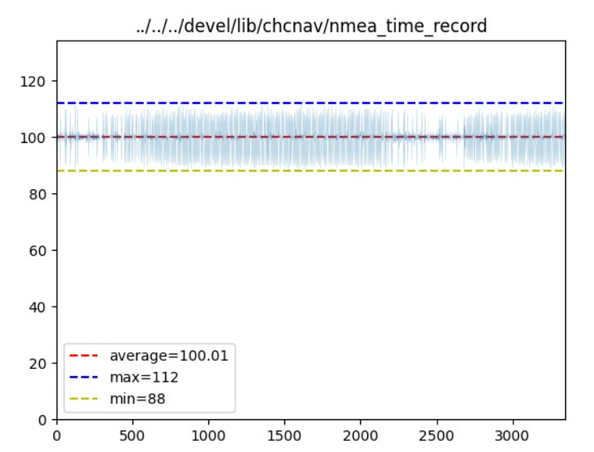

**Result Interpretation**:

- `average`: Average interval (ms), `1000/average` is the actual frequency; `max`/`min` are the maximum/minimum intervals.
- `hc_time_record`, `nmea_time_record` record the **receiving time**, affected by network/serial read delays.
- `devpvt_time_record`, `devimu_time_record` record the **GPS time** inside the protocol, not affected by transmission delays — if the three values are equal, it indicates no packet loss, no checksum failures; peaks appear when there is packet loss, as shown below with 1 packet loss, dropping `(40-10)/10 = 3` packets:

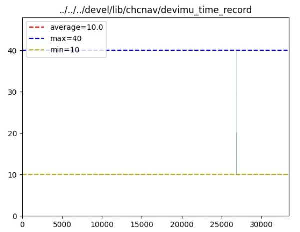
